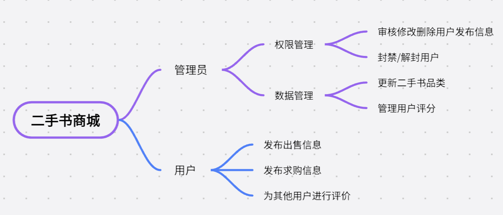
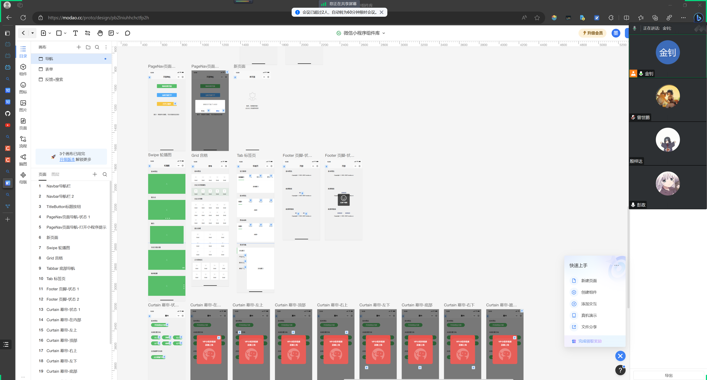
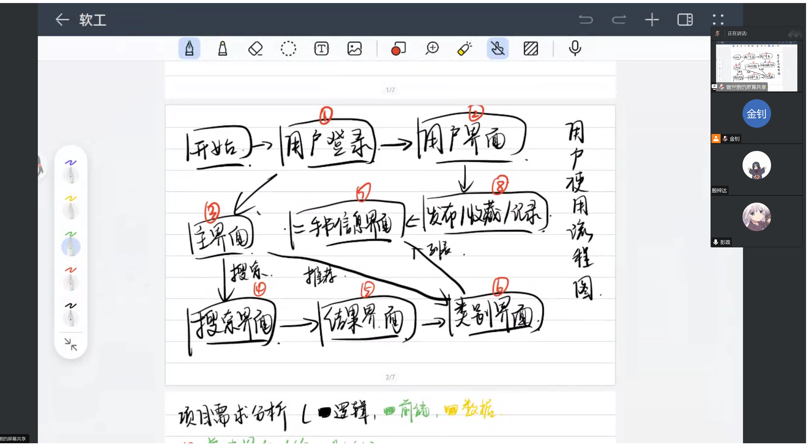

# 会议记录

- 时间 ：2023年10月4日

- 地点：腾讯视频在线会议

- 参会者： 计算机学院2108班金钊，曾世鹏，彭政，殷梓达

## 项目选择

**二手书交易平台微信小程序**
### 头脑风暴

## 主要技术栈

* 前端

* 后端

* 服务器配置

## 团队分工

* 前端开发：

* 后端开发：

* 接口对接

* 运行维护

## 项目分析

1. 需求分析：

   * qq群中经常有二手书交易

   * qq群的交易不能及时反馈且信息无法及时保存

   * 买卖双方不能及时获取信息

2. 好处：

   * 打破了通过群聊，跳蚤市场等相对封闭的交易方式带来的信息壁垒，为同学们提供了一个统一，高效，便捷的交易平台。一站式解决同学的二手教材书籍的出售或购买需求。

3. 竞争：

   * 现阶段主要竞争来自于因为用户较少，书源不足，导致用户在使用一次之后就会忘记本小程序，出现用户越来越少的情况。

## 思维导图

## 会议图片

