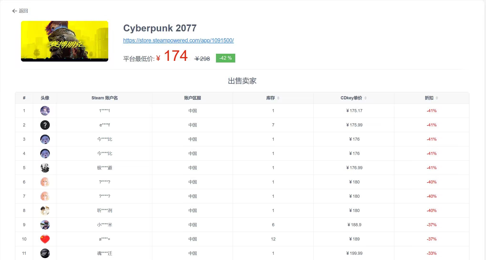
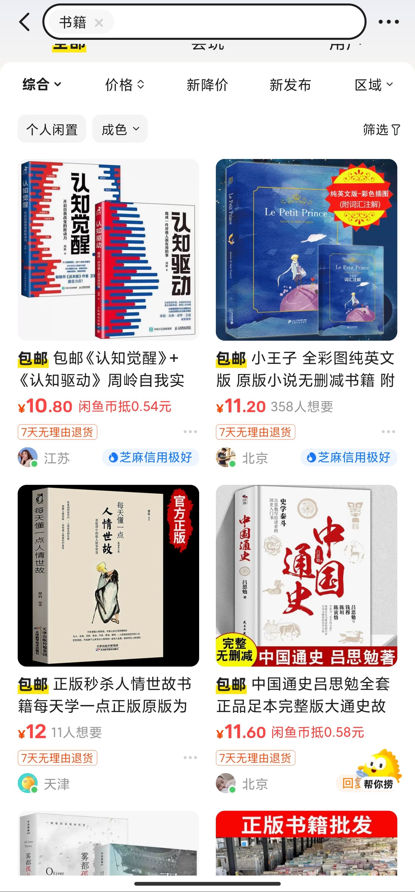
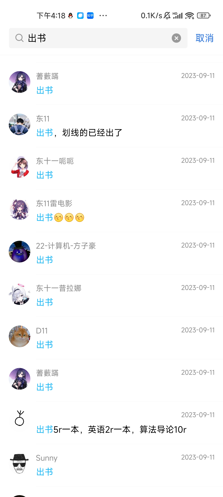

# 会议记录

- 时间 ：2023年10月4日

- 地点：腾讯视频在线会议

- 参会者： 计算机学院2108班金钊，曾世鹏，彭政，殷梓达

## 项目选择

**二手书交易平台微信小程序**
### 头脑风暴

steam PY市场是一个方便的平台，让Steam用户之间可以买卖游戏中的虚拟物品，如卡牌、饰品、皮肤等。该交易市场可以实时显示物品的市场价格和供求情况，方便用户根据自己的预算和需求进行合理的买卖。用户也可以设置自己的求购或出售价格，等待系统自动匹配合适的订单。

闲鱼二手交易平台也是国内知名的二手交易平台之一。闲鱼平台有以下便捷之处：

- 个性推荐：闲鱼会根据用户的浏览记录、收藏记录、搜索记录等数据，为用户推荐感兴趣的商品和鱼塘，帮助用户发现更多的好货和好玩的内容。用户也可以在“发现”页面看到不同的主题推荐，如“今日热卖”、“新品上架”、“热门鱼塘”等，方便用户快速找到自己想要的商品或者社区。
- 需求筛选：闲鱼提供了多种筛选条件，让用户可以根据自己的需求进行精准搜索。用户可以按照商品类别、价格区间、地区范围、是否包邮、是否支持退货等条件进行筛选，也可以按照商品的新旧程度、发布时间、销量等排序方式进行排序。用户还可以使用语音搜索或者扫码搜索，提高搜索效率和准确度。
- 界面设计：闲鱼的界面设计简洁明了，易于操作和浏览。闲鱼的主要功能分为“首页”、“发现”、“消息”、“我的”四个模块，分别对应了商品浏览、内容推荐、交易沟通、个人管理等功能。闲鱼的商品展示方式以图片为主，文字为辅，让用户一目了然地看到商品的外观和基本信息。闲鱼还支持下拉刷新和上拉加载更多，让用户可以无限滑动浏览商品。
- 商品参数：闲鱼在发布商品时，会根据用户选择的商品类别，自动匹配相应的参数选项，让用户可以快速填写商品的详细信息。例如，如果用户选择发布手机类别的商品，闲鱼会自动显示手机品牌、型号、颜色、内存、存储空间等参数选项，用户只需点击选择即可。这样可以提高发布效率，也可以方便买家筛选和比较商品。

考虑现状：华科沁苑帮帮忙群有很多出收二手物品和了解信息的需求，9月11号当天就有上百条消息。

但囿于QQ群能同时显示数量的限制，消息经常被刷下去。且还有出书和求书的信息不互通，经常出现出书和求书者不知道有对方的情况。

为了帮助华科学子更好利用二手书且增强信息流通，我们团队决定设计一个二手书信息平台。

## 主要技术栈

* 前端

* 后端

* 服务器配置

## 团队分工

* 前端开发：

* 后端开发：

* 接口对接

* 运行维护

## 项目分析

1. 需求分析：

   * qq群中经常有二手书交易

   * qq群的交易不能及时反馈且信息无法及时保存

   * 买卖双方不能及时获取信息

2. 好处：

   * 打破了通过群聊，跳蚤市场等相对封闭的交易方式带来的信息壁垒，为同学们提供了一个统一，高效，便捷的交易平台。一站式解决同学的二手教材书籍的出售或购买需求。

3. 竞争：

   * 现阶段主要竞争来自于因为用户较少，书源不足，导致用户在使用一次之后就会忘记本小程序，出现用户越来越少的情况。

## 思维导图

## 会议图片

